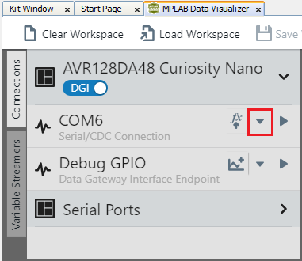
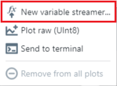

 <article class="markdown-body entry-content p-3 p-md-6" itemprop="This needs to locked down and 'never' changed">

 
# Analog-to-Digital Converter (ADC) - Single Conversion Using AVR128DA48 Microcontroller

In this application, the Analog-to-Digital Converter will perform single conversions, and the results will be transmitted through Universal Synchronous/Asynchronous Receiver/Transmitter (USART).
The software diagram of this application is presented in the figure below.
 

## Related Documentation

- [AVR128DA48 Data Sheet](http://ww1.microchip.com/downloads/en/DeviceDoc/40002183A.pdf)
- [AVR128DA48 Product Family Page](https://www.microchip.com/design-centers/8-bit/avr-mcus/device-selection/avr-da)
- [Using 12-Bit ADC for Conversions, Accumulation, and Triggering Events](https://www.microchip.com/wwwappnotes/appnotes.aspx?appnote=en1001530)

## Software Used

- [MPLAB® X IDE v6.15 or newer](https://www.microchip.com/en-us/tools-resources/develop/mplab-x-ide)
- [MPLAB® XC8 v2.45 or newer](https://www.microchip.com/en-us/tools-resources/develop/mplab-xc-compilers)
- [AVR-Dx Series Device Pack v2.3.272 or newer](https://packs.download.microchip.com)

## Hardware Used

- AVR128DA48 Curiosity Nano [(DM164151)](https://www.microchip.com/DevelopmentTools/ProductDetails/PartNO/DM164151)
- Curiosity Nano Base for Click boards™ [(AC164162)](https://www.microchip.com/developmenttools/ProductDetails/AC164162)
   

- [One POT Click board](https://www.mikroe.com/pot-click)
   

## Setup

The AVR128DA48 Curiosity Nano Development board is used as the test platform. To integrate the POT Click board, the Curiosity Nano Base for Click boards is used.

 

 The following configurations must be made:

|Pin           | Configuration      |
| :----------: | :----------------: |
|PD3 (AIN3)    | Analog Input       |
|PC0 (TX)      | Digital Output     |

## Demo

   - Open Data Visualizer
 
   - From the Curiosity Nano COMn port, open the drop down list:
 
   - From the drop down list, select New variable streamer...:
 
   - Configure the Variable Streamer Name and add the desired variable, then click Next:
 
   - Select all the variables to plot, select New axis per data type, and click Finish:
 

   - Result:

   Rotating the Potentiometer on the POT click board (after starting the application), the ADC result will be plotted on the graph:
    

## Summary 

This application showcases a basic example of the single conversion feature of the ADC. 

## How to Program the Curiosity Nano Board

This chapter shows how to use the MPLAB® X IDE to program an AVR® device with an Example_Project.X. This can be applied to any other projects.

- Connect the board to the PC

- Open the Example_Project.X project in MPLAB® X IDE

- Set the Example_Project.X project as main project

  - Right click the project in the **Projects** tab and click **Set as Main Project**
     

- Clean and build the Example_Project.X project

  - Right click the **Example_Project.X** project and select **Clean and Build**
     

- Select **AVRxxxxx Curiosity Nano** in the Connected Hardware Tool section of the project settings:

  - Right click the project and click **Properties**
  - Click the arrow under the Connected Hardware Tool
  - Select the **AVRxxxxx Curiosity Nano** (click the **SN**), click **Apply** and then **OK**:
     

- Program the project to the board
  - Right click the project and then **Make and Program Device**
     

[Back to Top](#analog-to-digital-converter-adc---single-conversion-using-avr128da48-microcontroller) 
[Back to Related Documentation](#related-documentation) 
[Back to Software Used](#software-used) 
[Back to Hardware Used](#hardware-used) 
[Back to Setup](#setup) 
[Back to Demo](#demo) 
[Back to Summary](#summary) 
[Back to How to program the curiosity nano board](#how-to-program-the-curiosity-nano-board) 